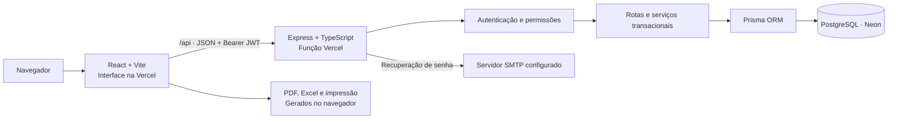

# Núcleo de Material e Patrimônio

Aplicação administrativa com React, TypeScript, Vite e API Express. Dados persistidos em PostgreSQL através do Prisma.

Portal para controlar materiais, entradas, saídas e bens patrimoniais, com acesso por perfil e rastreabilidade das operações.

**Ambiente publicado:** [Núcleo de Material e Patrimônio](https://nucleo-material-e-patrimonio.vercel.app).

## Navegação

- [Arquitetura](#arquitetura)
- [Recursos](#recursos)
- [Executar localmente](#executar-localmente)
- [Gráficos e indicadores](#gráficos-e-indicadores)
- [Verificação](#verificação)
- [Vercel e Neon](#vercel-e-neon)
- [Arquitetura detalhada e diagramas](docs/ARCHITECTURE.md)

## Arquitetura

- `frontend/`: interface, formulários Zod/React Hook Form e consultas TanStack Query.
- `backend/`: API REST, autenticação JWT, autorização por perfil e serviços transacionais.
- `backend/prisma/`: modelo relacional, migrations e dados de demonstração.
- `docs/`: documentação técnica e OpenAPI.



O monorepo usa npm workspaces. Em desenvolvimento, Vite e Express são processos separados. Em produção, a Vercel entrega os arquivos estáticos de `frontend/dist` e encaminha `/api` à função `api/index.js`. O Neon mantém os dados entre publicações.

| Camada                  | Tecnologias                                     | Responsabilidade                           |
| ----------------------- | ----------------------------------------------- | ------------------------------------------ |
| Interface               | React 19, TypeScript, Vite, React Router        | Navegação, telas e componentes responsivos |
| Formulários e consultas | React Hook Form, Zod, TanStack Query            | Validação, envio e atualização dos dados   |
| Visualização e arquivos | Recharts, jsPDF, AutoTable, ExcelJS, JsBarcode  | Gráficos, documentos e etiquetas           |
| API                     | Express 5, Zod, JWT, bcryptjs                   | Validação, autenticação e autorização      |
| Persistência            | Prisma, PostgreSQL                              | Relacionamentos, transações e migrations   |
| Qualidade               | Vitest, Supertest, Playwright, ESLint, Prettier | Testes e verificações do projeto           |

## Invariantes

Quantidades são movimentadas apenas pelo serviço de estoque. Cada operação bloqueia o registro do material dentro de uma transação, verifica disponibilidade, atualiza saldo e insere movimento e auditoria atomicamente. Correções são novas movimentações vinculadas ao registro original. O administrador pode remover materiais preservando o histórico ou apagar definitivamente o material e suas movimentações, mediante confirmação do código. A auditoria permanece preservada. Valores monetários usam Decimal no banco. Códigos de materiais e tombamentos têm restrições únicas.

## Perfis

Administrador: acesso completo. Gestor: estoque, movimentações, patrimônio e relatórios. Operador: cadastro de materiais e operações de estoque. Consulta: leitura. Toda permissão é verificada pela API.

## Recursos

- Login por e-mail ou matrícula, sessão persistente, recuperação de senha por SMTP e revogação de sessões.
- Dashboard com oito indicadores, quatro gráficos, alertas e últimas movimentações, atualizado a cada 30 segundos.
- Cadastros de materiais, categorias, fornecedores, setores, bens patrimoniais e usuários.
- Entrada e saída com confirmação, bloqueio de saldo insuficiente e estorno rastreável.
- Transferências de patrimônio e históricos por fornecedor, setor e bem.
- Doze relatórios com período, PDF, Excel e impressão, com emissão auditada.
- Busca global, paginação, filtros, ordenação, etiquetas CODE128, leitura por câmera ou leitor USB.
- Interface responsiva, tema claro/escuro, labels, foco visível e modais navegáveis por teclado.
- Auditoria protegida, Swagger/OpenAPI, migrations, testes e backup lógico.
- Validade opcional dos materiais, com identificação de vencidos e dos que vencem em até 30 dias.
- Modelos PDF de requisição, entrega, responsabilidade, transferência e inventário.
- Exclusão de outros usuários pelo administrador, com revogação do acesso e preservação do histórico.

## Gráficos e indicadores

O dashboard consulta `/api/dashboard` e apresenta oito indicadores: materiais cadastrados, itens em estoque, estoque baixo, sem estoque, entradas no mês, saídas no mês, valor do estoque e bens patrimoniais.

| Gráfico                 | Visualização       | O que representa                                            |
| ----------------------- | ------------------ | ----------------------------------------------------------- |
| Entradas e saídas       | Barras             | Quantidades movimentadas por mês nos últimos 12 meses       |
| Materiais por categoria | Rosca              | Distribuição dos cadastros ativos por categoria             |
| Mais movimentados       | Barras horizontais | Materiais com maior quantidade movimentada no período       |
| Evolução do estoque     | Linha              | Saldo agregado reconstruído pelo registro das movimentações |

Os gráficos usam os dados reais da API. A evolução do saldo considera a criação dos movimentos; a distribuição mensal de entradas e saídas usa a data da operação. Relatórios de estoque apresentam o cadastro e o saldo atual, sem inventário retroativo. Veja os [fluxos e o modelo de dados](docs/ARCHITECTURE.md).

## Executar localmente

Requisitos: Node.js 22.12 ou superior, npm e Docker Desktop com containers Linux. Também é possível usar PostgreSQL externo ajustando DATABASE_URL.

No PowerShell, utilize `npm.cmd` e `npx.cmd` se a política do Windows bloquear arquivos `.ps1`.

```powershell
npm.cmd install
npm.cmd run setup
docker compose up -d db
npm.cmd run db:generate -w backend
npm.cmd run db:deploy
npm.cmd run db:seed
npm.cmd run dev
```

Interface: http://localhost:5173. API: http://localhost:3001/api. Swagger: http://localhost:3001/api/docs.

O setup cria `backend/.env` com JWT e senha inicial aleatórios, preservando arquivos existentes. Login inicial: `admin@nucleo.local` ou matrícula `0001`; senha em `SEED_ADMIN_PASSWORD` no arquivo local. A senha não é embutida na aplicação nem publicada neste README. O seed é idempotente e não redefine senhas de usuários existentes. Cadastros demonstrativos e CNPJ fictício destinam-se ao desenvolvimento.

O PostgreSQL é exposto apenas em `127.0.0.1:15432`, evitando conflito com instalações existentes. Credenciais locais do Compose são apenas para desenvolvimento.

## Recuperação de senha

Configure SMTP_HOST, SMTP_FROM e as demais variáveis SMTP no backend. Sem SMTP, a interface informa que a recuperação está indisponível. Links expiram em 30 minutos, são armazenados como hash e podem ser utilizados apenas uma vez. Redefinição e alteração de senha revogam sessões anteriores.

## Verificação

```powershell
npm.cmd run build
npm.cmd run lint
npm.cmd test
npm.cmd run test:prepare
npm.cmd run test:integration
npx.cmd playwright install chromium
npm.cmd run test:e2e
npm.cmd run format:check
```

`test:prepare` cria/migra/carrega `nucleo_test`, sem apagar registros. TEST_DATABASE_URL deve apontar a um banco diferente da aplicação. Integração verifica login, RBAC, unicidade, transações, duas saídas concorrentes, estorno, proteção de histórico no banco, transferências, relatórios, busca e redefinição de senha. E2E valida sessão, tema, responsividade, cadastro, entrada, saída, saldo insuficiente, histórico e exportação. O Playwright inicia API e frontend usando o banco de testes; a suíte utiliza as portas isoladas 41731 e 41735, que devem estar livres.

## Backup

```powershell
npm.cmd run db:backup
```

Gera um dump PostgreSQL no formato custom em `backups/`, ignorado pelo Git. Requer o container db em execução. Para restaurar, envie o arquivo a um banco novo usando `pg_restore`; valide a restauração antes de substituir qualquer banco existente. O backup contém dados administrativos e deve ficar em armazenamento restrito. Para PostgreSQL externo, utilize pg_dump com as credenciais administradas do ambiente.

## Regras e limites

- Quantidades inteiras; valores monetários Decimal com duas casas. Saldo inicial é registrado como entrada pelo seed; cadastros novos começam em zero.
- Estoque baixo: saldo positivo menor ou igual ao mínimo. Crítico: nessa faixa e até 25% do mínimo, com limite inferior de uma unidade. Sem estoque: zero.
- Edição de setor patrimonial utiliza transferência. Bens baixados não podem ser transferidos.
- Remover um material preservando histórico define `deletedAt`, inativa o cadastro e reserva seu código. A exclusão definitiva elimina suas movimentações em uma transação com autorização delimitada no banco; a auditoria não é apagada.
- Excluir um usuário define `deletedAt`, inativa sua conta e revoga sessões. O cadastro deixa a lista, mas permanece no banco para manter a autoria do histórico. E-mail e matrícula continuam reservados. A própria conta do administrador não pode ser excluída.
- A validade é uma data opcional do material, sem controle separado de lotes. Um material com validade vencida recebe indicação na interface; isso não bloqueia automaticamente movimentações.
- Os modelos de documentos geram arquivos PDF a partir dos campos preenchidos; não registram entradas, saídas ou transferências no banco.
- Listagens na interface paginam os registros carregados; a API de materiais/movimentações também oferece paginação opcional. Para bases grandes, priorize consultas paginadas no servidor.
- Leitura por câmera depende de HTTPS/localhost, permissão de câmera e suporte a BarcodeDetector. Leitores USB que digitam o código e enviam Enter funcionam no campo de código; entrada manual está disponível.
- Tokens expiram em oito horas; é necessário novo login após expiração. Logout encerra todas as sessões do usuário.
- PDF/XLSX são gerados no navegador. Relatórios de estoque representam o saldo atual, sem reconstrução de inventário retroativo.

## Documentação

- [Campos, rotas e permissões da API](docs/API.md)
- [Arquitetura, modelo de dados e fluxos](docs/ARCHITECTURE.md)
- [Variáveis de ambiente e orientações de produção](docs/ENVIRONMENT.md)
- [Requisitos e cobertura](docs/REQUIREMENTS.md)

## Vercel e Neon

O projeto está configurado para publicar a interface e a API na Vercel com PostgreSQL no Neon. Consulte o [guia de publicação e migração de dados](docs/VERCEL_NEON.md) para configurar as conexões, aplicar migrations, transferir dados existentes e publicar. A publicação exige acesso aos projetos nas plataformas.

Com o projeto vinculado e as variáveis de produção configuradas:

```powershell
npm.cmd run db:deploy
npx.cmd vercel deploy --prod
```

O comando de migrations da raiz usa `DIRECT_URL` quando definida e, caso contrário, `DATABASE_URL`. O build da Vercel gera o cliente Prisma e compila as duas aplicações; ele não aplica migrations. Aplique as alterações do banco antes de publicar código que dependa delas. A configuração de produção fica em `vercel.json`; segredos ficam nas variáveis do ambiente, nunca em arquivos versionados.
