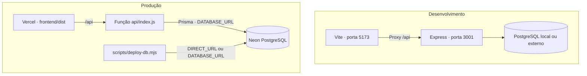
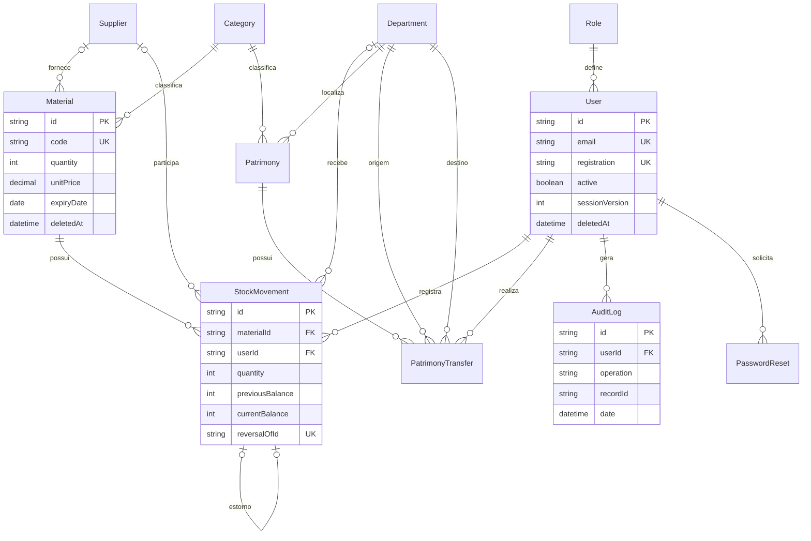
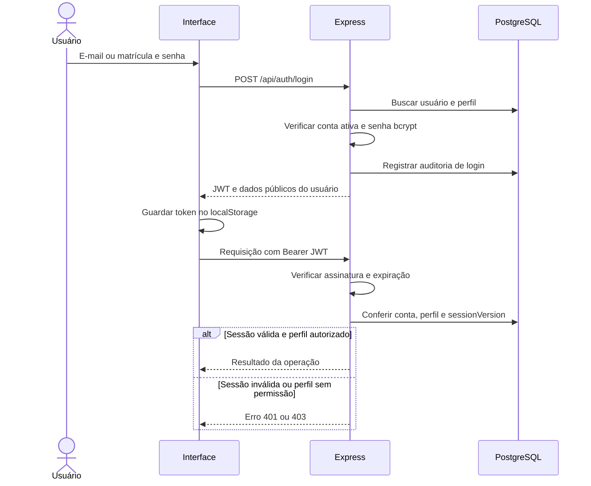
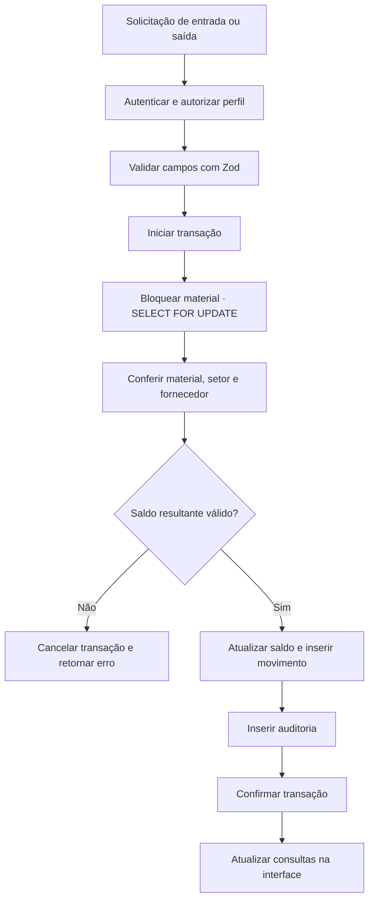
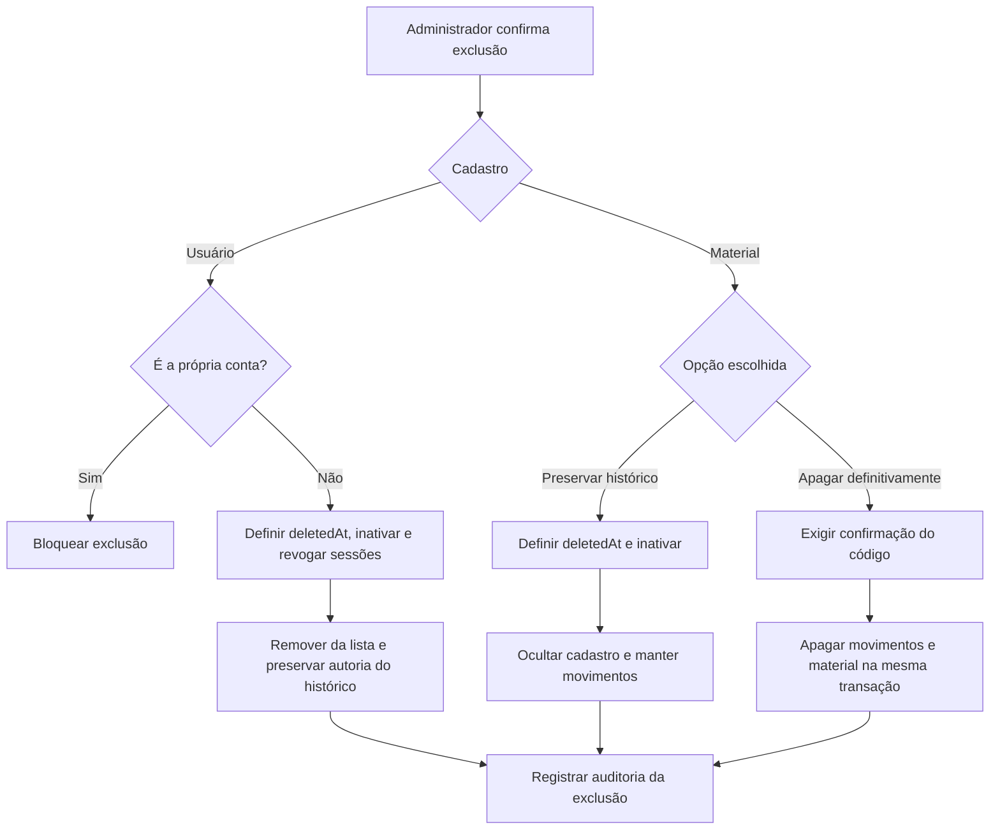

# Arquitetura do Núcleo de Material e Patrimônio

Este documento descreve a implementação existente. Os diagramas representam componentes e fluxos do projeto, sem valores demonstrativos de estoque.

## Organização do código

```text
Estoque/
├── frontend/src/
│   ├── pages/          Telas de login, dashboard, cadastros e relatórios
│   ├── components/     Modais, formulários e biblioteca de documentos
│   ├── contexts/       Sessão, tema e notificações
│   ├── layouts/        Barra lateral e cabeçalho
│   ├── schemas/        Configuração dos cadastros
│   ├── services/       Cliente HTTP da API
│   └── utils/          Formatação, validade e geração de documentos
├── backend/
│   ├── src/
│   │   ├── app.ts      Montagem da aplicação Express
│   │   ├── routes/     Endpoints por domínio
│   │   ├── controllers/Autenticação
│   │   ├── middlewares/Autorização e tratamento de erros
│   │   ├── schemas/    Validação das requisições
│   │   ├── services/   Movimentações transacionais
│   │   ├── repositories/ Cliente Prisma
│   │   └── utils/      Regras de saldo, sessão e ambiente
│   ├── prisma/         Schema, migrations e seed
│   └── tests/          Testes unitários e de integração
├── api/index.js        Entrada da API na Vercel
├── scripts/            Setup, migrations, testes e backup
├── docs/               Documentação técnica
└── vercel.json         Build, função e reescrita das rotas
```

O frontend compartilha a página `Entities` entre os cadastros, com campos definidos em `schemas/entities.ts`. O cliente HTTP inclui o token e trata sessões expiradas. TanStack Query mantém as consultas e invalida os dados após alterações. Modais e formulários reutilizam componentes comuns.

## Desenvolvimento e produção



As rotas da interface retornam `index.html` para que React Router resolva a navegação. As rotas `/api` são encaminhadas ao backend. A API usa JSON, validação Zod, Helmet, CORS e autenticação antes dos endpoints privados. `/api/health` verifica a conexão com o banco. `/api/docs` e `/api/openapi.json` expõem a documentação da API.

## Modelo de dados

O diagrama mostra as principais relações. Campos e restrições completos estão em [schema.prisma](../backend/prisma/schema.prisma).



`StockMovement` guarda saldo anterior e posterior e pode referenciar um movimento estornado. `PatrimonyTransfer` mantém origem, destino e responsável. `AuditLog.recordId` identifica o registro da operação e não é uma chave estrangeira genérica; pode continuar registrando uma exclusão definitiva.

## Autenticação e sessão



O JWT expira em oito horas. Logout, alteração de senha e alterações administrativas incrementam `sessionVersion`, invalidando os tokens anteriores. A exclusão de usuário também inativa a conta, remove tokens de recuperação e preserva sua identificação nos históricos. A API impede excluir a própria conta administrativa.

| Operação                                 | ADMIN | MANAGER | OPERATOR | VIEWER |
| ---------------------------------------- | ----- | ------- | -------- | ------ |
| Consultar dashboard e cadastros comuns   | Sim   | Sim     | Sim      | Sim    |
| Cadastrar materiais e categorias         | Sim   | Sim     | Sim      | Não    |
| Registrar entradas e saídas              | Sim   | Sim     | Sim      | Não    |
| Estornar movimentações                   | Sim   | Sim     | Não      | Não    |
| Cadastrar e transferir patrimônio        | Sim   | Sim     | Não      | Não    |
| Gerenciar fornecedores e setores         | Sim   | Não     | Não      | Não    |
| Acessar relatórios                       | Sim   | Sim     | Não      | Sim    |
| Gerenciar usuários e consultar auditoria | Sim   | Não     | Não      | Não    |
| Excluir materiais ou outros usuários     | Sim   | Não     | Não      | Não    |

As permissões são verificadas na API. Ocultar botões na interface complementa essa validação.

## Movimentação de estoque



O bloqueio serializa operações concorrentes no mesmo material. Saldo, movimento e auditoria são confirmados juntos. Uma saída com saldo insuficiente é rejeitada. O estorno cria uma movimentação inversa vinculada à original, mantendo o registro anterior.

## Exclusões e preservação de histórico



Na remoção com preservação, códigos de materiais, e-mails e matrículas continuam reservados pelas restrições únicas. A exclusão definitiva de material usa uma exceção transacional delimitada no trigger de proteção do histórico. Ela não autoriza excluir auditoria ou movimentos de outros materiais.

## Dashboard, relatórios e documentos

```mermaid
flowchart LR
  DB[("Dados persistidos") ] --> Dashboard["GET /api/dashboard"]
  DB --> Reports["GET /api/reports/:kind"]
  Dashboard --> Metrics["Oito indicadores e alertas"]
  Dashboard --> Charts["Recharts · quatro gráficos"]
  Reports --> Export["Tabela, PDF, Excel e impressão"]
  Forms["Campos dos modelos de documentos"] --> PDF["PDF com itens e assinaturas"]
```

Os relatórios aplicam período conforme seu domínio: operações por data de movimentação ou transferência, e patrimônio pela aquisição. Estoque e fornecedores representam o cadastro atual. A biblioteca de documentos gera PDFs de requisição, entrega, responsabilidade, transferência e inventário no navegador; preencher um modelo não executa uma operação de estoque.

A validade pertence ao material e é opcional. A interface distingue datas vencidas, vencimento em até 30 dias e datas posteriores. Não há modelagem de validade por lote nem bloqueio automático de movimentação por vencimento.

## Qualidade e operação

- Testes unitários: regras de saldo, status e validação de validade.
- Testes de integração: API e PostgreSQL, incluindo concorrência, estorno, exclusões e revogação de acesso.
- Testes E2E: navegação e operações no navegador via Playwright.
- Migrations: alterações versionadas em `backend/prisma/migrations`.
- Backup local: `scripts/backup.mjs`; para banco externo, usar processo de backup adequado ao ambiente.

Os testes de integração e E2E precisam de um banco separado. Os comandos de preparação e publicação estão no [README](../README.md), e as variáveis estão em [ENVIRONMENT.md](ENVIRONMENT.md). Detalhes de hospedagem e conexão estão em [VERCEL_NEON.md](VERCEL_NEON.md).

## Limites atuais

Listagens da interface ainda paginam dados carregados, embora alguns endpoints ofereçam paginação no servidor. Exportações são geradas no navegador. Datas de operação podem ser retroativas; por isso os gráficos de movimentação e de evolução de saldo usam referências temporais diferentes. A documentação OpenAPI deve ser mantida em conjunto com novas rotas e campos.
